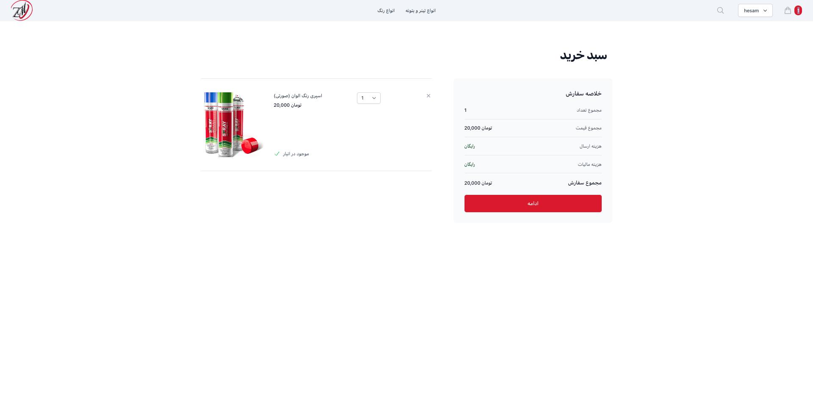

# ecommerce-react-DRF-API
## this is my first react-djangoDRF with special API Projecct I wish you will enjoy (:

# Features

- Full featured shopping cart
- Product reviews and ratings
- Top products carousel
- Product pagination
- Product search feature
- User profile with orders
- Admin product management
- Admin user management
- Admin Order details page
- Mark orders as delivered option
- Checkout process (shipping, payment method, etc)

# Download & Setup Instructions

- 1 - Clone project: git clone https://github.com/Hesam-Dearboy/ecommerce-react-DRF-API.git
- 2 - cd backend
- 3 - Create virtual environment: virtualenv myenv
- 4 - myenv\scripts\activate
- 5 - pip install -r requirements.txt
- 6 - python manage.py runserver

# Install react modules
- cd frontend
- npm i 
- npm start
